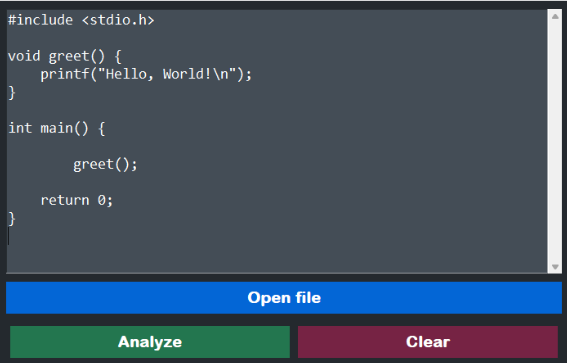
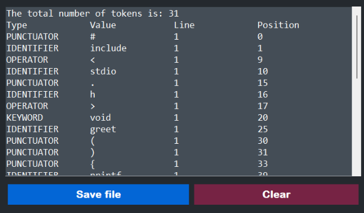

# Team05-Compilers-Lexer

## National Autonomous University of Mexico  
**Faculty of Engineering**  
**Compilers**  

### Lexer Report  
**Students:**  
- 320280324 Balam Flores Gabriel Patricio  
- 320338274 Solé Pi Arnau Roger  
- 320182668 Hernández Domínguez Luis Carlos  
- 320516467 Cervantes Mateos Leonardo  

**Group:** #05  
**Semester:** 2025-2  

Repository: [GitHub](https://github.com/BalmyM4/unam.fi.compilers.g5.05.git)  

---

## Index
1. [Introduction](#introduction)
2. [Theoretical Framework](#theoretical-framework)
3. [Development](#development)
4. [Results](#results)
5. [Conclusion](#conclusion)
6. [References](#references)

---

## Introduction
The compilation of a program is a process that translates source code so the computer can execute it correctly. The first stage of this process is called lexical analysis, which is responsible for breaking down the source code into tokens. This task is performed by a program called a lexer — a component of the compiler that reads the source code and produces a sequence of tokens.

For a program to execute correctly, it is essential to have a reliable lexer that performs its task accurately. In this document, we present a lexer developed using tools based on PLY. Through the development of this lexer, we aim to gain a better understanding of its functionality and importance within the compilation process. As well as achieve a fully functional lexer.

---

## Theoretical Framework
To perform lexical analysis, the lexer uses regular expressions (regex). According to [1], "Regular expressions are a notation used to describe all the languages that can be built from applying the language operators union, concatenation, and closure to the symbols of some alphabet." The use of regular expressions instead of grammars makes the lexer more efficient.

The result of this process is a sequence of tokens. A token is defined as "a pair consisting of a token name and an optional attribute value. The token name is an abstract symbol representing a kind of lexical unit, e.g., a particular keyword, or a sequence of input characters denoting an identifier" [1]. Tokens are typically classified into the following categories:

- **Identifier:** Variable names, functions, etc.
- **Operator:** `+`, `-`, `*`, etc.
- **Keyword:** `return`, `int`, etc.
- **Constant:** `1`, `3`, `5`, etc.
- **Literals:** Strings inside `" "`.
- **Punctuators:** `{`, `}`, `(`, `)`, etc.

This classification is crucial for the next phase of the compilation process: syntax analysis. During syntax analysis, token names are often referred to as terminals, as they appear as terminal symbols in the grammar of the programming language.

Context-free grammars (CFG) are the primary type of grammar used to define the syntax of programming languages. They systematically describe language constructs such as expressions and statements.

A key part of this analysis is parsing, defined as "the process of determining how a string of terminals can be generated by a grammar" [1]. For parsing to succeed, the CFG mustn't be ambiguous — meaning the grammar must not produce more than one possible parse tree for the same string. Also, the grammar cannot have left recursion, a situation where the leftmost symbol of the body is the same as the non-terminal at the head of the production. which can cause the parser to enter an infinite loop.

In order to prepare the grammar for a top-down parsing it’s necessary to apply left factoring. “When the choice between two alternative A productions is not clear, it’s possible to rewrite the productions to defer the decisions until enough of the input has been seen to make the right decision.” [1]

A → αβ1|αβ2

Deferring the decision by expanding A to A’ allows us to see the input derived from α, and expanding A’ to β1 or β2. The original production becomes.

A → αA’
A’→ β1| β2

---

## Development

### Lexer Implementation
The lexer was implemented using PLY, a Python tool for lexing and parsing. The main functions used include:

- `lex()` – Builds the lexer using defined token rules.
- `lex.input()` – Feeds input for tokenization.
- `lex.token()` – Extracts the next token.
- `t_error()` – Handles tokenization errors.
- `t_identifier()` – Identifies keywords and identifiers.
- `t_literal()` – Recognizes literals.

### Graphical Interface
The user interface was developed using Tkinter, with the following functions:

- `open_file()` – Loads a file and displays its content.
- `get_text()` – Extracts input from the UI.
- `analyze_text()` – Runs the lexer and displays results.
- `save_file()` – Saves the output.
- `clear_text_area()` & `clear_result_area()` – Clears UI fields.

### Key Tkinter Elements
- `tk.Tk()` – Creates the main window.
- `tk.Label()` – Displays text labels.
- `tk.Button()` – Adds interactive buttons.
- `tk.Text()` – Implements text input areas.
- `tk.mainloop()` – Runs the UI loop.

---

## Results
Below are the results of the lexer implementation. The images illustrate the graphical user interface, the input file used for tokenization, and the corresponding output after processing.

### User Interface

### Input Example

### Output Example

---

## Conclusion
Developing a lexer required the use of multiple theoretical concepts such as regular expressions or context free grammars. It also implied comprehending what was the  purpose behind the lexical analysis, which is basically to tokenize the source code to prepare it for the parsing process. It’s important as well for the grammar that defines the language to not present any of the next problems: left recursion and ambiguity.

In the end, the lexer is only the first step towards the compiler, but it’s important for the future development of the parser and eventual development of the compiler that the lexer, as well as all the theoretical bases are well thought out to prevent any major problems in the future.

---

## References
[1] A. V. Aho, M. S. Lam, R. Sethi, and J. D. Ullman, *Compilers: Principles, Techniques, and Tools*, 2nd ed. Pearson, 2007.
